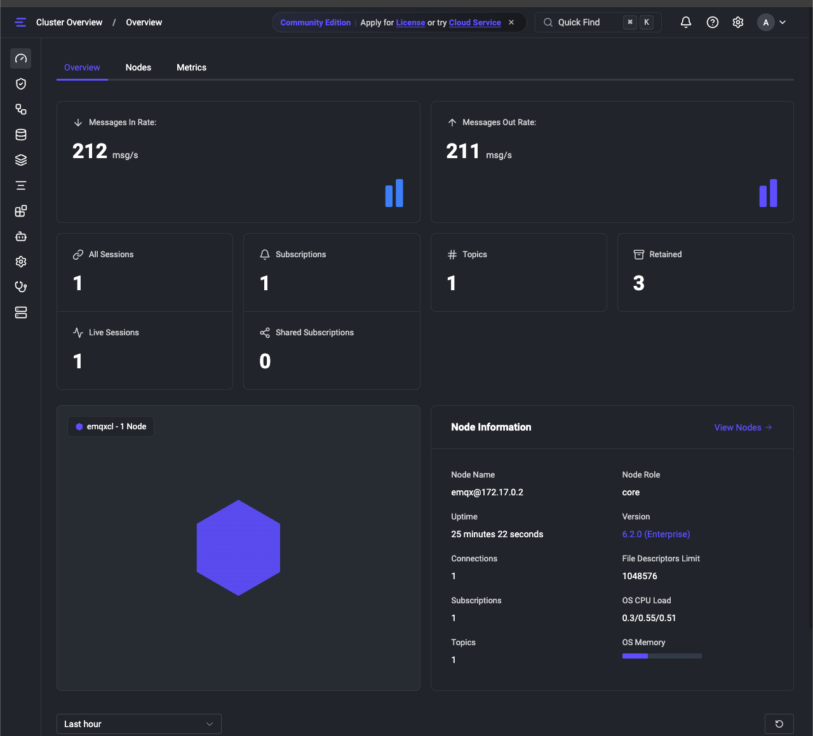
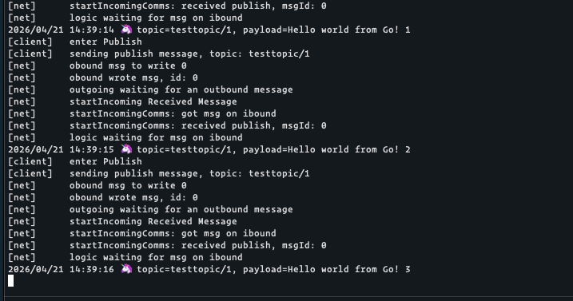

## POC-EMQX-GO

This is repository for POC EMQX with Go. It contains a simple example of how to use EMQX with Go.

### How to run

```sh
make start # start docker single node
make open-emqx-dashboard # open emqx dashboard
go run main.go
```


### Screenshots





### Reference
- https://docs.emqx.com/en/emqx/latest/connect-emqx/go.html